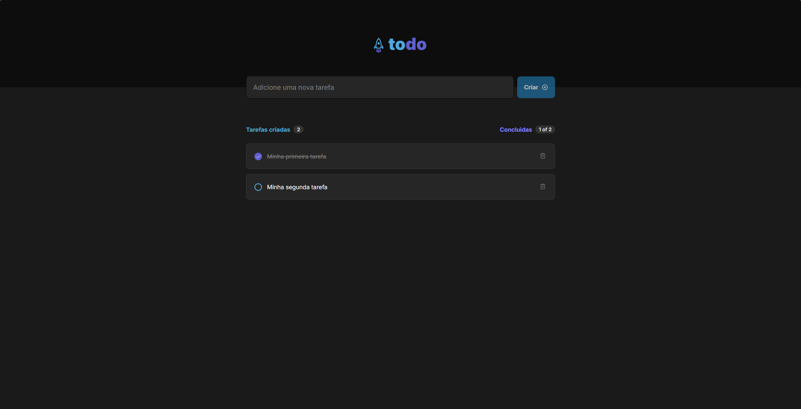

<h1 align="center">
    
</h1>
<p align="center">Todo. Um aplicativo otimizado com atualização otimista, proporcionando uma experiência ágil ao adicionar, excluir e concluir tarefas.</p>
<p align="center">
 <a href="#sobre-o-projeto">Sobre o Projeto</a> |
 <a href="#tecnologias">Tecnologias</a> |
 <a href="#iniciando-o-projeto">Iniciando o projeto</a> |
 <a href="#licença">Licença</a> |
 <a href="#autor">Autor</a> 
</p>

### Sobre o Projeto

Todo é um aplicativo de gerenciamento de tarefas que utiliza o método de atualização otimista, permitindo uma experiência mais fluida e rápida para os usuários. Com ele, é possível realizar ações como adicionar, excluir e concluir tarefas sem interrupções, garantindo um processo contínuo e eficiente.

- [x] Criação de tarefas
- [x] Exclusão de tarefas
- [x] Marcar tarefas como concluídas
- [x] Experiência rápida e sem bloqueios

---

### Tecnologias

- [ReactJs](https://reactjs.org/) - Biblioteca JavaScript para construir interfaces de usuário
- [TypeScript](https://www.typescriptlang.org/) - Superset de JavaScript que adiciona tipagem estática
- [Vite](https://vitejs.dev/) - Ferramenta de build
- [ESLint](https://eslint.org/) - Linter para código JavaScript e TypeScript

---

### Como Começar

```bash
# Clone o aplicativo
$ git clone https://github.com/sillasemanoel/todo-list

# Navegue até o diretório do aplicativo
$ cd todo-list

# Instale as dependências
$ npm i

# Para iniciar o aplicativo
$ npm run dev
```

---

### Licença

Distribuído sob a Licença MIT. Veja [LICENSE](LICENSE) para mais informações.

---

### Autor

Feito por Sillas Emanoel 👋🏽
